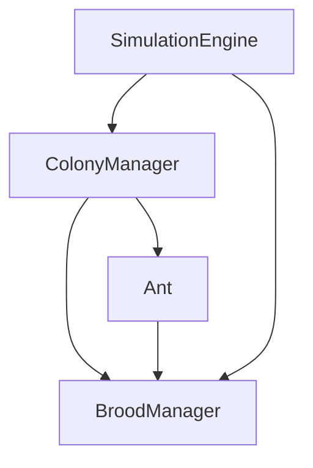

# Decouple Brood Lifecycle & Nurse Space Design

Introduce a standalone `BroodManager` class to extract brood management out of `ColonyManager` and implement space-aware nursery mechanics, Queen pacing transitions, and nurse redistribution.

## Proposed Architecture

### 1. `BroodManager` class
*   **File Path**: [BroodManager.ts](file:///home/jordan/Projects/ant-farm-simulator/src/simulation/BroodManager.ts)
*   **Purpose**: Standalone container for all egg/larva/pupa lists, hatch timers, growth ticks, and spatial nursery queries.
*   **Properties**:
    *   `public broodList: Brood[]`
    *   `public nurseryCapacity: number = 15`
*   **Methods**:
    *   `public update(dt: number, hatchAnt: (x: number, y: number) => void, addLog: (msg: string, cat: 'system' | 'births' | 'deaths') => void): void`
    *   `public getNurseryOccupancy(nursery: Position): number`
    *   `public isNurseryFull(nursery: Position): boolean`
    *   `public isNurseryCrowded(nursery: Position): boolean`
    *   `public getAvailableNursery(nurseries: Position[]): Position | null`
    *   `public findSpacedPositionInNursery(grid: WorldGrid, nursery: Position): Position | null`

### 2. Queen Relocation and Pacing
*   **File Path**: [Colony.ts](file:///home/jordan/Projects/ant-farm-simulator/src/simulation/Colony.ts)
*   **Changes**:
    *   Add `currentNursery?: Position` and `path?: Position[] | null` to the `queen` object.
    *   Initialize `queen.currentNursery` to the first nursery in the list (Royal Chamber offset).
    *   If `queen.path` is set: she walks along the path at slow speed (`0.12 * speedMultiplier`). Upon reaching within 10px of the target, clears path, sets `queen.currentNursery` to the target, and resets pacing targets.
    *   If `queen.path` is not set: she paces inside `[queen.currentNursery.x - 20, queen.currentNursery.x + 20]` at height `queen.currentNursery.y`.
    *   If her egg timer reaches 0 and her current nursery is full: she searches for an available nursery using `broodManager.getAvailableNursery(nurseries)`. If found, she paths to it and pauses egg-laying until arrival.

### 3. Nurse Spacing & Redistribution
*   **File Path**: [Ant.ts](file:///home/jordan/Projects/ant-farm-simulator/src/simulation/Ant.ts)
*   **Changes**:
    *   Modify dropping target coordinate to scan the nursery using `broodManager.findSpacedPositionInNursery(grid, targetNursery)`. The spacing algorithm searches in concentric/random offsets from the nursery center to find a walkable `NestAir` grid cell that is at least 8px (2 cells) away from any other brood item.
    *   Add redistribution check in `updateNurse`: if the nurse has no cargo/brood and is near a crowded nursery (occupancy >= 12 / 15), she checks if another nursery has an occupancy difference of >= 3. If so, she has a 20% chance to pick up a random brood item from the current crowded chamber and carry it to the less crowded nursery.

## Verification Plan

### Unit Tests
*   Create `src/simulation/BroodManager.test.ts` to verify:
    *   Egg hatching, larval feeding, growth, and pupation lifecycle ticks.
    *   Nursery capacity checking, crowded checks, and nursery vacancy sorting.
    *   Physical spacing calculation finding empty spots >= 8px away from other brood.

### Manual Verification
*   Launch simulation and observe:
    *   Brood items distributed neatly across the royal chamber instead of overlapping on a single spot.
    *   The Queen traveling from a full nursery chamber down to a newly excavated nursery chamber, walking along the path, and beginning to lay eggs in the new chamber.
    *   Nurse ants carrying brood items out of a crowded nursery chamber into less occupied nursery chambers.
